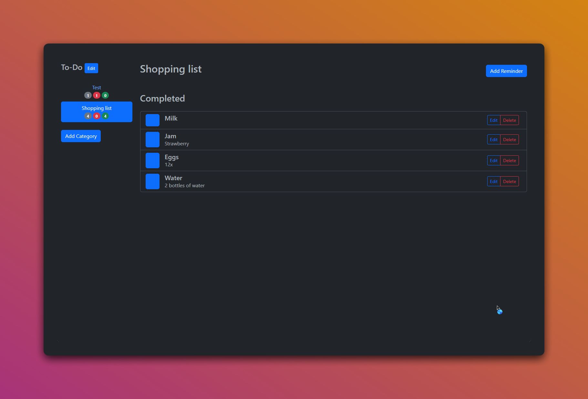

# ☑️ To-Do Website



[](https://getbootstrap.com/)
[](https://nodejs.org/)
[](https://expressjs.com/)
[](https://developer.mozilla.org/en-US/docs/Web/JavaScript)

## 📝 Description

The **To-Do Website** is a simple and intuitive web application that allows users to manage tasks and reminders. It supports creating categories, adding tasks with priorities, and tracking completed tasks. Built using modern web technologies like Bootstrap, Express.js, and EJS templating, this app is perfect for personal task management.

## ✨ Features

- **Task Management**: Add, edit, and delete tasks with ease.
- **Categorization**: Organize tasks into categories.
- **Priority Setting**: Assign priority levels to tasks.
- **Completion Tracking**: Easily track completed tasks.
- **Responsive Design**: Fully responsive, ensuring usability across all devices.

## 🚀 Getting Started

To get started with the To-Do Website, follow the instructions below:

1. **Clone the repository:**

   ```bash
   git clone https://github.com/EXELVI/To-Do-Website.git
   cd To-Do-Website
   ```

2. **Install dependencies:**
Ensure you have [Node.js](https://nodejs.org/) installed on your system.

   ```bash
   npm install
   ```

3. **Set up environment variables:**

   Create a `.env` file in the root directory and add the following environment variables:

   ```env
   mongodb="Your MongoDB connection string"
   sessionSecret="Your session secret (can be any random string)"
   clientSecret="Your Discord OAuth2 client secret"
   clientID="Your Discord OAuth2 client ID"
   ```

4. **Start the server:**

   ```bash
   node index.js
   ```

5. **Open the website:**
   
      Visit `http://localhost:3000` in your web browser to access the To-Do Website.

## ❔ Usage

1. **Categories:** Begin by adding categories for your tasks.
2. **Adding Tasks:** Click on "Add Reminder" to create a new task within a selected category.
3. **Task Management:** Edit or delete tasks as needed using the provided buttons.
4. **Completion:** Mark tasks as complete by checking the box next to them. Completed tasks are moved to the "Completed" section.

## 🫱 Contributing

Contributions are welcome! If you have ideas for improvement or have found bugs, feel free to open an issue or submit a pull request.
